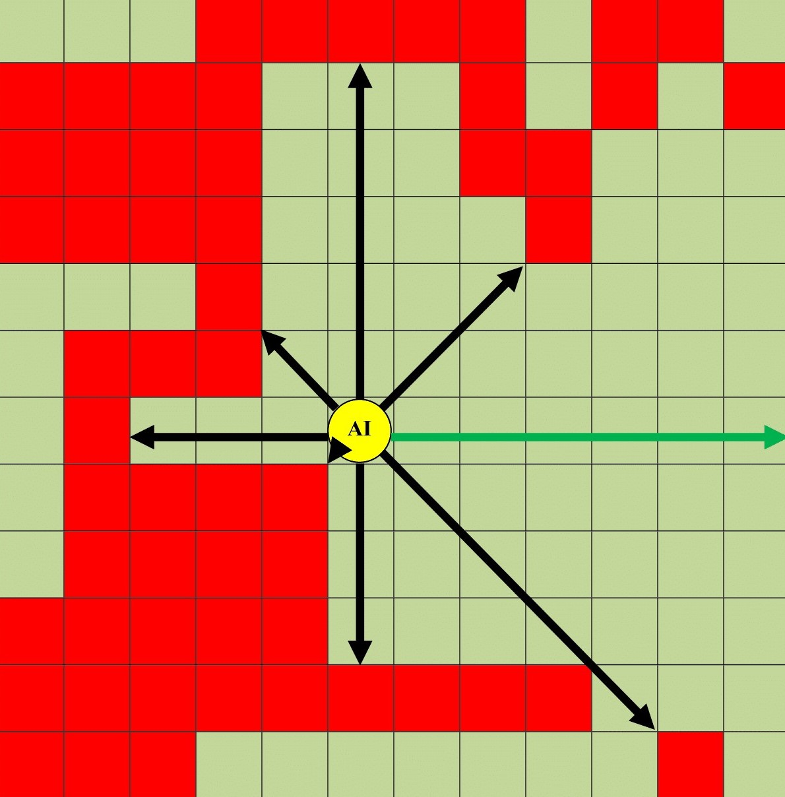

## Video

## Project Summary

## Approaches

### Building the game:

Game rules:
We implemented the game ourselves. The game is a survival game in Minecraft and the player tries to survive in the map as long as possible. During the game, each player walks inside a plain ground and each tile of the ground disappears 10 seconds after a player stepped on it. Players have to keep moving in order to survive. 

Implementing the game:

We wrote a special block that will be destroyed 10 seconds after something collides with it. However, the Minecraft API is limited, and does not have the function for delaying the destruction. To solve that problem, we implemented a hashmap (dictionary) to store all the destructions and time spot. Then, we destroy the blocks after the time in the dictionary is 10 seconds earlier than the current time.

After creating the block, we designed the map with 40 * 40 special block. To prevent the player going beyond the ground, we surround it with diamond block that is 10 units high. To make sure the player lose after it falls off the ground, we put 2 layers of lava underneath the ground.

(For more information about how the game works, please watch our video.)
{:class="img-responsive centered" height="50%"}

### Implementing the Artificial Intelligence:

Our artificial intelligence tries to survive in this floor falling game. It uses algorithms with three types of logics to find the best direction that it should go. The algorithm takes the input of all the map’s available ground location (as a matrix of 1 and 0) and the player location. The algorithm outputs the best direction the player should go in the next second.

The three types of logic that our algorithm has are ranked by complexity. Initially, the player will use the smartest logics which is really time-consuming. When the situation becomes more and more complex, the player will choose the algorithm that is simpler, but faster.

#### Three levels of smartness:

#####Level 1: Immediate decision
If the player is running out of time to think about his current situation, he will look up all the eight directions of his current location. He will count the number of tiles each direction can reach if he walks straight to that single direction for the rest of the game. Then, he will choose the direction with the longest path from the count.
{:class="img-responsive centered" height="50%" width="50%"}

#####Level 2: Two steps decision
If the player has more time, he will look around the eight adjacent tiles of him. For each tile, he will count the total length of the eight direction value in the previous algorithm as the score of that tile. Then, the player will move to the tile with the highest score.
{:class="img-responsive centered" height="50%" width="50%"}

#####Level 3: Navigating to best point
If the player still has some time, he will iterate through all the tiles in the map and find the tile that has the maximum possibility to survive. Then, he will navigate to that tile (output the first navigation direction).
{:class="img-responsive centered" height="50%" width="50%"}

More specifically about the third level of smartness, the player will select the tile with maximum possibility to survive by using a new algorithm inspired by state transition machine.

#### Algorithm:

Comment: since each tile is represented by 1 in the input matrix and the missing tile is represented by 0, we tried to find the tile that surround by other tiles in the center.

1. Find all the tiles reachable by player by using breadth first search.
2. For each tile reachable, add its surrounding tiles’ score to itself and output the new score to a new matrix. In that way, if a tile is surrounded by 8 tiles, it will have a higher score than the ones surrounded by 7 tiles.
3. Then, we repeat the first step 8 times so that each tile will be impacted by surrounding tiles with a diameter of 8.
4. We compare all the tiles score and find the tiles with the highest score. (There may be several of them)
5. We reassign each highest score tiles to be 1 and other tiles to be 0
6. We repeat step 2-5 until there are only 4 or less tiles remaining
7. We randomly select one of the remaining tiles and consider it as the tile with the highest possibility of survival.

After selecting the targeted tile, we use the Dijkstra’s algorithm to find the shortest path between the player and the targeted tile. Finally, we output the first step of that path.

## Evaluation

## References
