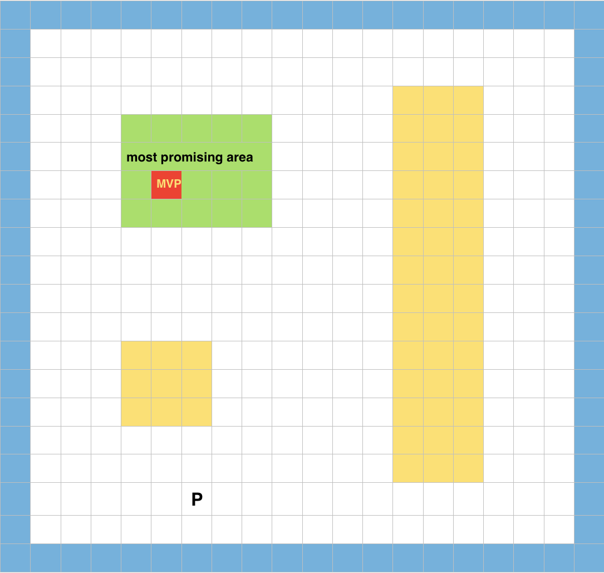
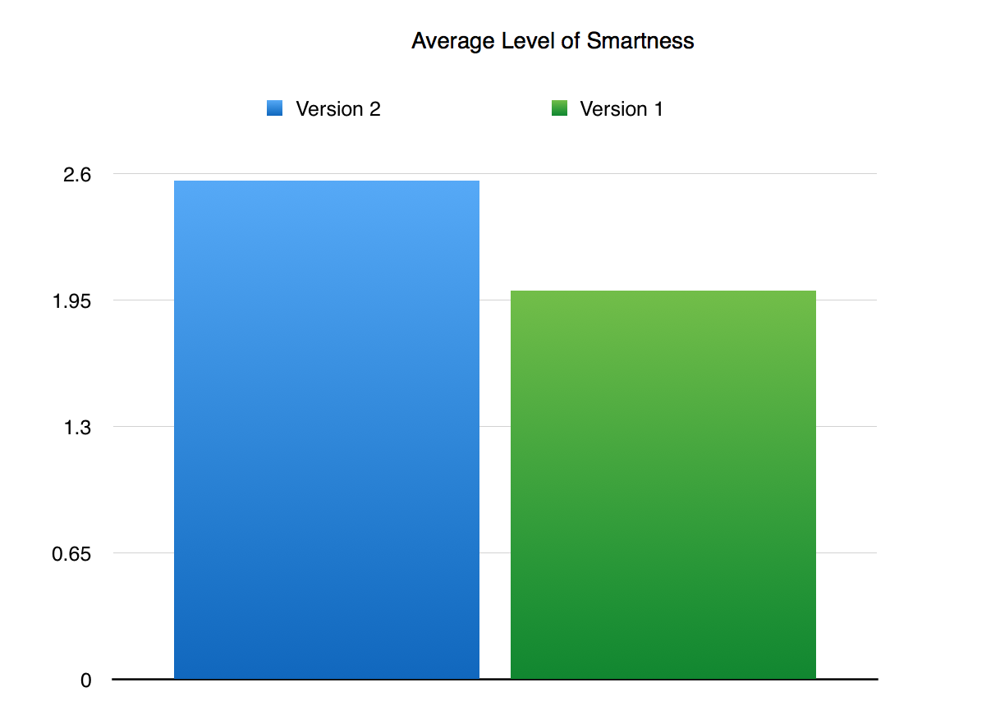

# Project Summary

TeamKill is an Artificial Intelligence Malmo-based project developed for a single/multi-player Minecraft survival mini-game called “Falling Floor”. The project consists of two parts, including the game construction and the AI implementation. 

We used Minecraft forge to build the game. While playing the game, players will spawn in a random location in a 40 * 40 grid. They run through special tiles that will disappear 10 seconds after stepped on. 

The second part is to create an intelligent agent that tries to survive in the game. Our AI is fully observable and it finds the best move every second. We created our own algorithm consisting state transition machine, Dijkstra’s algorithm for our AI to help him think like a human.

Our ultimate goal is to make the AI defeating human players. To do that, we will have to add reinforcement learning for AI to learn how to play offensive. 

<iframe width="1120" height="630" src="https://www.youtube.com/embed/glNiOwP4hp8" frameborder="0" allowfullscreen></iframe>

# Approach

## Building the game:

Game rules:
We implemented the game ourselves. The game is a survival game in Minecraft and the player tries to survive in the map as long as possible. During the game, each player walks inside a plain ground and each tile of the ground disappears 10 seconds after a player stepped on it. Players have to keep moving in order to survive. 

Implementing the game:

We wrote a special block that will be destroyed 10 seconds after something collides with it. However, the Minecraft API is limited, and does not have the function for delaying the destruction. To solve that problem, we implemented a hashmap (dictionary) to store all the destructions and time spot. Then, we destroy the blocks after the time in the dictionary is 10 seconds earlier than the current time.

After creating the block, we designed the map with 40 * 40 special block. To prevent the player going beyond the ground, we surround it with diamond block that is 10 units high. To make sure the player lose after it falls off the ground, we put 2 layers of lava underneath the ground.

(For more information about how the game works, please watch our video.)
{:class="img-responsive centered" height="50%"}

## Implementing the Artificial Intelligence:

Our artificial intelligence tries to survive in this floor falling game. It uses algorithms with three types of logics to find the best direction that it should go. The algorithm takes the input of all the map’s available ground location (as a matrix of 1 and 0) and the player location. The algorithm outputs the best direction the player should go in the next second.

The three types of logic that our algorithm has are ranked by complexity. Initially, the player will use the smartest logics which is really time-consuming. When the situation becomes more and more complex, the player will choose the algorithm that is simpler, but faster.

#### Three levels of smartness:

1. If the player is running out of time to think about his current situation, he will look up all the eight directions of his current location. He will count the number of tiles each direction can reach if he walks straight to that single direction for the rest of the game. Then, he will choose the direction with the longest path from the count.
{:class="img-responsive centered" height="50%" width="50%"}

2. If the player has more time, he will look around the eight adjacent tiles of him. For each tile, he will count the total length of the eight direction value in the previous algorithm as the score of that tile. Then, the player will move to the tile with the highest score.
{:class="img-responsive centered" height="50%" width="50%"}

3. If the player still has some time, he will iterate through all the tiles in the map and find the tile that has the maximum possibility to survive. Then, he will navigate to that tile (output the first navigation direction).
{:class="img-responsive centered" height="50%" width="50%"}

More specifically about the third level of smartness, the player will select the tile with maximum possibility to survive by using a new algorithm inspired by state transition machine.

#### Algorithm:

Comment: since each tile is represented by 1 in the input matrix and the missing tile is represented by 0, we tried to find the tile that surround by other tiles in the center.

1. Find all the tiles reachable by player by using breadth first search.
2. For each tile reachable, add its surrounding tiles’ score to itself and output the new score to a new matrix. In that way, if a tile is surrounded by 8 tiles, it will have a higher score than the ones surrounded by 7 tiles.
3. Then, we repeat the first step 8 times so that each tile will be impacted by surrounding tiles with a diameter of 8.
4. We compare all the tiles score and find the tiles with the highest score. (There may be several of them)
5. We reassign each highest score tiles to be 1 and other tiles to be 0
6. We repeat step 2-5 until there are only 4 or less tiles remaining
7. We randomly select one of the remaining tiles and consider it as the tile with the highest possibility of survival.

After selecting the targeted tile, we use the Dijkstra’s algorithm to find the shortest path between the player and the targeted tile. Finally, we output the first step of that path.

# Evaluation

#### Human thought
In order to show that our AI is great, we try to prove that it thinks like a human. Normally, when we play the ground falling game, we will go away from the enemy players and go toward the directions that have bigger lands. In our algorithm, smartness level 3 is trying to human’s thought. The AI will find the ground center that has the largest ability of expansion. The AI will then, navigate to that point.

However, the algorithm is really time-consuming and we provide the AI with simpler choices. At version 1, only when the situation is easier for the AI to do the human thought, will the AI do it. Usually, it happens when the AI is trapped on a small island with less than 100 tiles. If it uses the algorithm in a larger island, it will take more than 1 seconds to determine the next move. However, the AI usually moves 2-3 tiles each second, so it will die with that much delay. At that phase, we consider our AI to be: barely working.

After finishing the second version, we dramatically improve the running speed of our algorithm and enable it to calculate the whole map (1600 tiles) within 0.25 seconds in Python. At this phase, our AI can easily use the human logic and navigate to that direction.

#### Prove by data:
To demonstrate the speed of the AI’s logic, will make the agent run in a single player map and watch how long he can stay alive without enemies. We will record the time usage of our algorithm, the level of smartness in each of them. If the time usage of our algorithm is shorter and the average level of smartness is higher, the agent is considered better.

Initially, we thought that if the agent runs through all the tiles available, we will consider that the agent is as good as a human being. However, that is not smart if we think that there are enemies on our map. If there are no enemies, the agent should just circle around the map to get the maximum number of tiles, but that makes the agent vulnerable if there are enemies. The enemy will just come and cut your route. So we do not require our agent to take up all the tiles, but require him to go to the best location for survival which is usually, the center of the map (or available tiles).

#### Time Limit:
Another evaluation factor is the possibility of death that is due to an inappropriate action. Currently, our agent does not do well when it reaches the margin. However, we try to decrease that possibility. We realized that if the AI make decisions too slow, it is very likely that it went to the wrong direction. (since the correct direction has not been returned yet) To solve that problem, we gave an even more strict time limit for our AI: 0.2 seconds. Then, we evaluate our agent by comparing its error possibilities to the previous version. If it reaches the both the accepted speed and accepted error possibilities, we consider that it is successful.

# Challenges faced:

1. Minecraft API is limited, we built our game with algorithms to surpass the missing API.
2. The initial AI algorithm is slow because it tries to find the best tile for this phase with step 2, but repeat n/2 times. That makes the algorithm running time O(8^n). So what modified our algorithms to this version which has the running time of  O(n^1.5). (n is the number of tiles)

# Remaining Goal and Challenges:
1. Our algorithm is fast enough to support smartness level 3 single player version, but remains level 2 in multi-agent (all of them are AI) version. We will improve that in the future.
2. Our algorithm computes the player’s location based on matrix. However, the real AI’s location is not a decimal number. We rounded it off to be integer, but there are some special cases when the AI is standing in the corner of a tile, but want to go to another corner’s direction. That makes it goes to an adjacent tile first before it reaches its goal tile. We will make our agent think about that in the future.
3. In order to make our AI looks more similar to human players, we need to add the attacking algorithm to it. Currently, the AI just tries to go the best location for survival. In the next phase, we will teach the AI to identify the vulnerable opponent and tries to kill them. We will do that through reinforcement learning and train the AI by making multiple AIs play against each other.

